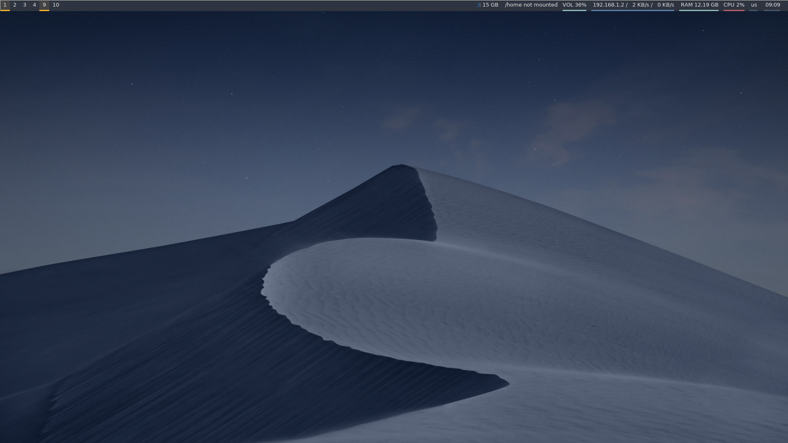
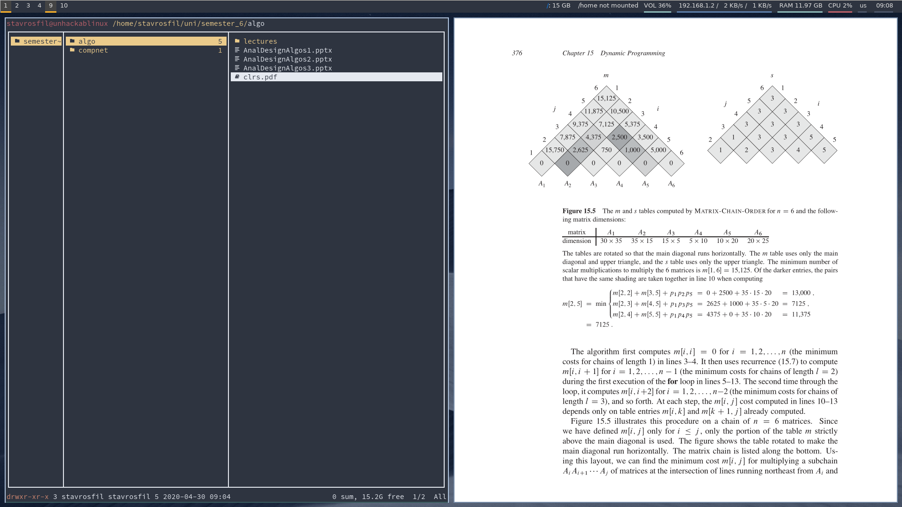
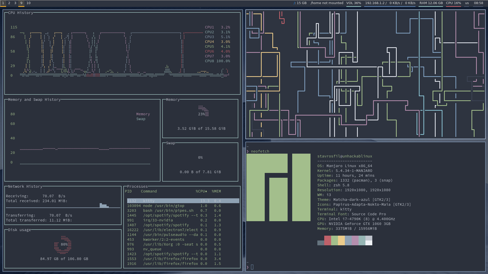

# Dotfiles

A functional and beautiful `i3wm` config for programming, studying and browsing, made primarily for `arch` based distros (manjaro, arch).

## Installation

To use the setup right away, the `sync.sh` file will come in handy.

- Create a `repos` folder in your home directory
- Clone this repository inside `repos`
- Run the script

```bash
$ cd $HOME
$ mkdir repos
$ cd repos
$ git clone https://github.com/stavrosfil/dotfiles
$ cd dotfiles
$ bash sync.sh
```

Done. Now your settings are symlinked in the respective directories and you can edit everything within `dotfiles` folder. The script will also install the below applications necessary for the setup to function properly.

## Prerequisites

Some of the base packages installed with the execution of sync script:
```
rofi
feh
polybar
kitty
firefox
playerctl
httpie
maim
zathura
zathura-pdf-mupdf
adobe-source-code-pro-fonts
```

# Screens




